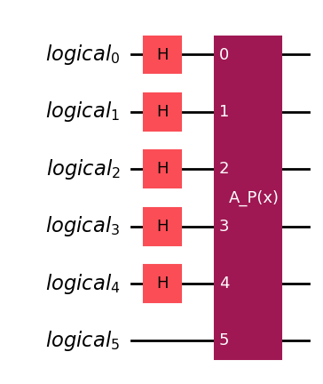

# Quantum Integration Engine ⚛️


A generalized quantum algorithm to calculate the definite integral of arbitrary mathematical functions using Iterative Quantum Amplitude Estimation (IQAE), demonstrating a quadratic speedup over classical Monte Carlo methods.

---

## Overview

This project provides an end-to-end framework for quantum integration. It takes a classical, continuous function defined by the user, approximates it with a polynomial, encodes it into a quantum oracle, and runs it on a quantum simulator to calculate the definite integral with a user-specified precision.

The core result is an experimental verification of the quadratic quantum speedup, showing that the quantum algorithm requires significantly fewer function queries than its classical counterpart to achieve the same level of accuracy.

---

## The Science Behind It

The algorithm leverages a powerful mapping between classical integration and quantum probability estimation.

1.  **Integral to Probability:** A definite integral $I = \int_a^b f(x) dx$ can be rewritten in terms of the average of a scaled function $p_{scaled}(x) = \frac{f(x)-m}{M-m}$, where $m$ and $M$ are the minimum and maximum of $f(x)$ on the interval. The average value, which is a probability $a$, is related to the integral by:
    $$I = a \cdot (b-a)(M-m) + m(b-a)$$

2.  **State Preparation:** We prepare a quantum state on $n+1$ qubits. The first $n$ qubits are put into a uniform superposition $\frac{1}{\sqrt{2^n}}\sum_{i=0}^{2^n-1} |i\rangle$ to represent the integration domain. An oracle then rotates an ancilla qubit such that the probability of measuring it in the $|1\rangle$ state is equal to our target probability $a$.

3.  **Quantum Oracle:** To handle arbitrary functions, we first find a **Chebyshev polynomial approximation** of the user's function. This provides a near-optimal polynomial representation with uniformly distributed error. The plot below shows an example approximation of a target function.

    ![Chebyshev Approximation Plot of log(x) in domain [1,10] scaled to [-1,1]](images/chebyshev_approximation.png)

    The corresponding error of this approximation across the interval is minimal, as shown below.

    ![Chebyshev Error Plot of log(x) in [1,10] scaled to [-1,1]](images/chebyshev_error.png)

    The coefficients of this polynomial are then loaded into a `PolynomialPauliRotations` gate. The full state preparation circuit `A`, including the initial Hadamards and the polynomial oracle, is constructed as follows:

    

4.  **Amplitude Estimation:** Instead of just measuring, which is inefficient, we use the **Iterative Quantum Amplitude Estimation (IQAE)** algorithm. IQAE intelligently applies the Grover operator $Q$ to find the probability $a$ with a precision of $\epsilon$.

5.  **The Quantum Speedup:** The key advantage lies in the scaling. To achieve a precision of $\epsilon$, the number of queries ($M$) required by each method is:
    * **Classical Monte Carlo:** $M_{classical} \approx O\left(\frac{1}{\epsilon^2}\right)$
    * **Quantum Amplitude Estimation:** $M_{quantum} \approx O\left(\frac{1}{\epsilon}\right)$

This quadratic difference in scaling is the source of the quantum speedup.
    ![Speedup Plot of x**2 in domain [0,9]](images/speedup_plot.png)

---

## Installation

1.  Clone the repository:
    ```bash
    git clone [https://github.com/Adithya2685-git/Quantum-General-Integration-Algorithm.git](https://github.com/Adithya2685-git/Quantum-General-Integration-Algorithm.git)
    cd Quantum-General-Integration-Algorithm
    ```

---

## Usage

To run an integration, execute the main script with the desired parameters.
